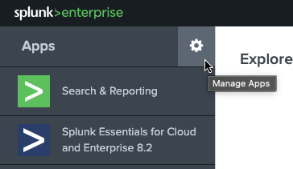
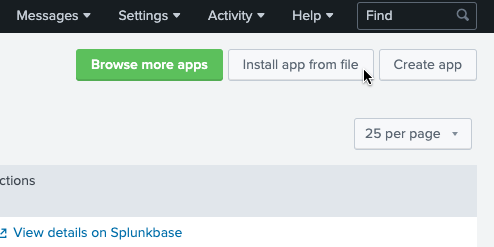
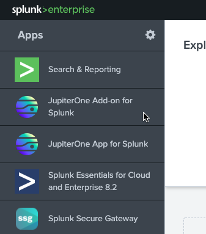
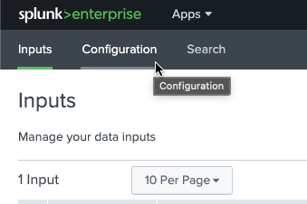
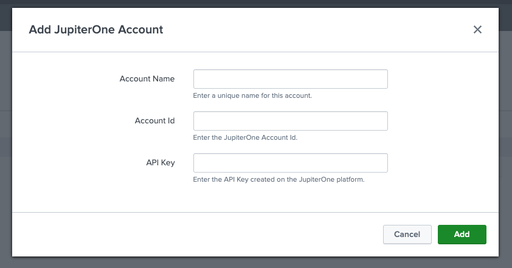
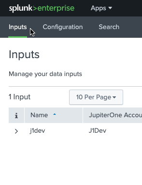
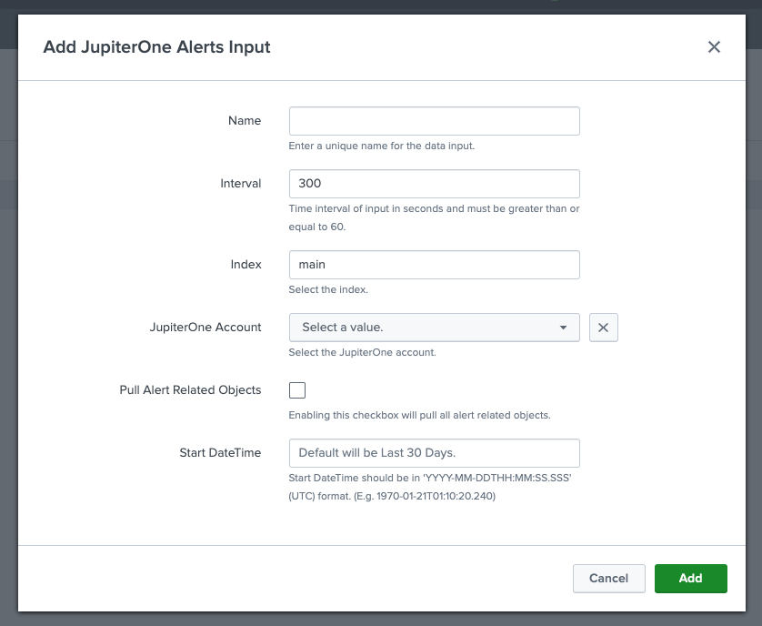

# Integration with JupiterOne

## Splunk + JupiterOne Integration Benefits

- Import JupiterOne alert data to your Splunk account
- View alerts on a Splunk dashboard
- Link back to alerts in JupiterOne for easy access to additional information

## How it Works

- Splunk periodically imports alert details from JupiterOne
- Write your own Splunk searches to find data about JupiterOne alerts
- View JupiterOne alerts on a dashboard in Splunk with breakdowns by severity, over time, active and dismissed 

## Requirements

- A JupiterOne API token and your JupiterOne account ID.
- Splunk Enterprise 8.0, 8.1 or 8.2
- Permission to install new Add-ons and Apps in Splunk.

## Support

If you need help with this integration, please contact
[JupiterOne Support](https://support.jupiterone.io).

## Integration Walkthrough

### In JupiterOne

1. [Generate an API token](https://support.jupiterone.io/hc/en-us/articles/360025847594-Enable-API-Key-Access)
2. Look up your `accountId` by executing this query in your JupiterOne account: `find jupiterone_account`.  The result should have a column labeled `accountId`

### Install Add-on and App in Splunk

1. On the Splunk Home Dashboard, use the Find More Apps link to find and install the JupiterOne Add-on and JupiterOne App

or

1. Download the [Add-on](https://splunkbase.splunk.com/app/6138) or [App](https://splunkbase.splunk.com/app/6139) package from the Splunkbase marketplace
2. In Splunk navigate to **Apps > Manage Apps** by clicking on the gear icon in the upper left corner

3. In the top right corner select **Install app from file**

4. Select **Choose File** and select the Add-on or App package you downloaded
5. Select **Upload** and follow the prompts

### Configure the Add-on in Splunk

1. In Splunk, navigate to the **JupiterOne Add-on for Splunk**

1. Click on **Configuration**.

2. Click on **Add** to create a new JupiterOne Account configuration.

3. In the Add JupiterOne Account screen, fill in an **Account Name**, the **Account Id** and the **API Key**.  Click **Add** when finished.

4. If needed, configure a proxy on the Proxy tab
5. If desired, change the log level on the Logging tab.  The default is INFO.
6. Navigate to the **Inputs** tab

7. Click on **Create New Input**
8. Fill in the details and click the **Add** button

| Field Name | Field Description                  |
| ------------------ | -----------------------------------|
| Name*               | Unique name for the data input     |
| Interval*           | Time interval of input in seconds.  How often the data is collected from JupiterOne.  |
| Index*              | Index where data will be stored    |
| JupiterOne Account* | Account that was configured in the **Configuration** tab |
| Pull Alert Related Objects | If enabled, pulls data for entities in Alert |
| Start DateTime | Date in UTC when you want to start collecting data.  Default is 30 days in the past. |

`*` denotes required field

### Configure the App in Splunk

Once the Add-on is configured and running, the App will work.  There is no configuration needed.

More details are available on the Splunkbase marketplace for the [Add-on](https://splunkbase.splunk.com/app/6138) and the [App](https://splunkbase.splunk.com/app/6139)