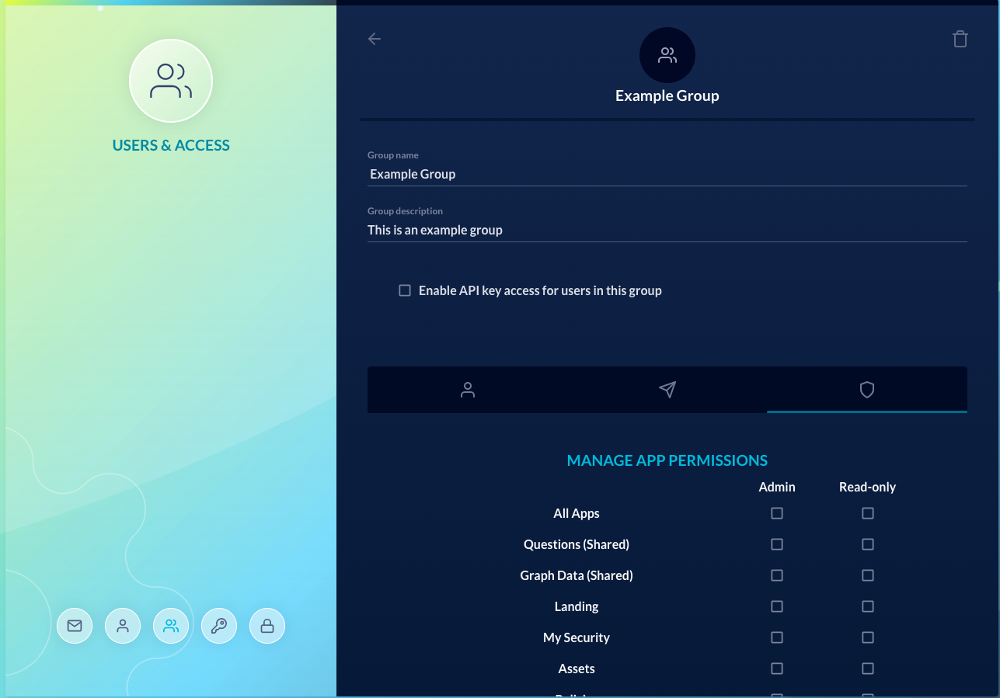

# JupiterOne Access Controls

Each JupiterOne account has either one of the following two access control
configurations applied:

- **Standard Access Control** (default on all accounts)
- **Granular Access Control** (available upon request to all PLUS/ENTERPRISE
  tier accounts)

## Standard Access Control

**Standard access control** is the default configuration on all JupiterOne
accounts. There are two access levels across all resources:

- Users in the **Administrators** group have **full admin access** to all
  resources

- All other users (users in other groups) have **read-only access** to all
  resources, plus the permission to **save queries as questions**.

This is similar to the **Top Level Permissions** in Granular Access Control,
as explained further below.

## Granular Access Control

**Granular access control** is available to all PLUS and ENTERPRISE tier
accounts. It allows more fine grain access configuration at each User Group
level to achieve role-based access control (RBAC).

When enabled, access permissions can be configured by navigating to:

**Settings** (cogwheel icon on top nav bar) -> **Users & Access** -> Select the
**user group** to be edited -> Then clicking on the **Shield icon**.

  

Permissions are configured per group, and any users in a group will be able to
perform the actions assigned by the permissions editor.  Permissions may take up
to 5 minutes to propagate.

Each **app level category** has two permissions: **Read-only** and **Admin**.
**Admin** permissions will allow all actions included in the **Read-only**
permissions for each app.

Each **shared permission** has two permissions: **Read** and **Write**. **Read**
permissions will allow access to retrieving the resource, while **Write** will
allow mutating / editing of the resource. **Write** permission **does not**
implicitly grant **Read** permission in this case, unlike how admin permissions
grant read-only permissions implicitly in the case of app level permissions.

### Top Level Permissions

**Top level permissions** applies to all apps and pages.

- If a group is assigned **top level Admin** access, users in that group will be
  allowed to perform any action in any app as well as on shared resources.

- If a group is assigned **top level Read-only** access, the users in that group
  will be allowed to access all apps and read all data including on shared
  resources, however they will not be able to perform actions that require write
  level permissions (e.g. creating a rule in the Alerts app).

### Global Shared Permissions

**Shared permissions** are not bound to a specific app, but are relevant to
resources that span different apps.

List of shared permissions:

- **Graph Data** (used anywhere entity and relationship data is retrieved on
  demand or when entities / relationships are mutated directly; also used for
  raw data associated with entities)

- **Questions** (saved J1 queries used in the Landing page Questions Library and
  in Compliance app for mapping to compliance requirements)
  
Some of these permission will be needed for an app to function fully. For
example, you will not have much luck using the Insights app without read
permissions for Graph Data as the dashboards and widgets won't be able to load
the data!

### App Level Permissions

**App level permissions** such as Alerts Read or Alerts Admin apply to the
application pages shown primarily on the app switcher. However, a few other
categories have been added including Integrations and Endpoint Compliance Agent
despite that they are not strictly apps, they function as one and it was easy to
group their responsibilities together.

Admin permissions for each app allows certain administrative actions unique to
each app. For example, add a new standard / questionnaire in Compliance app;
save board layout as default in Insights app; etc. Certain actions also require
shared permissions to global resources to be enabled.

Users not assigned any access at either top level or app level permissions will
receive an "Access Denied" error message when attempting to navigate to the app.

The full list of the apps is here, along with shared permissions that may be
used by features in each app:

!!! note 
    You may see a subset of these apps in your settings based on your account subscription level.

- Landing (the base/root page - `/`)
  
  > Shared permissions used by this app: **Read / Write Questions** and
  > **Read Graph Data** for access to Questions Library and running J1QL queries
  > respectively. Optionally **Write Graph Data** for editing entities from
  > query results.

- My Security (URL ending with `/mysecurity`)
  
  > Shared permissions used by this app: **Read Graph Data** for populating
  > table / widgets

- Assets Inventory (URL ending with `/inventory`)
  
  > Shared permissions used by this app: **Read / Write Graph Data**
  > (app is unusable without Read Graph Data, Write Graph Data used for editing
  > entities)

- Policies (URL ending with `/policies`)
  
  > Shared permissions used by this app: **Read Graph Data** for loading the
  > policy elements and raw data, and **Write Graph Data** for saving changes to
  > the policy entities.

- Alerts (URL ending with `/alerts`)
  
  > Shared permissions used by this app: **Read Graph Data** (need only for the
  > Vulnerability Findings view, the Alerts view will load results from a
  > historical snapshot and does _not_ need Read Graph Data permission)

- Compliance (URL ending with `/compliance`)
  
  > Shared permissions used by this app: **Read Graph Data** for expanding
  > queries used as evidence to view results, **Read / Write Questions** for
  > editing the questions used in this app.

- Graph Viewer (URL ending with `/galaxy`)
  
  > Shared permissions used by this app: **Read Graph Data**. App will not
  > function without this permission as it is focused on graph exploration.

- Insights (URL ending with `/insights`)
  
  > Shared permissions used by this app: **Read Graph Data**. Dashboards and
  > widgets will not load without this permission.

- Integrations (URL ending with `/integrations`)

  > Shared permissions used by this app: none

- Endpoint Compliance Agent "Power up" (URL ending with `/powerups/endpoint-agent`)

  > Shared permissions used by this app: **Read Graph Data**, used to
  > fetch users and devices.
