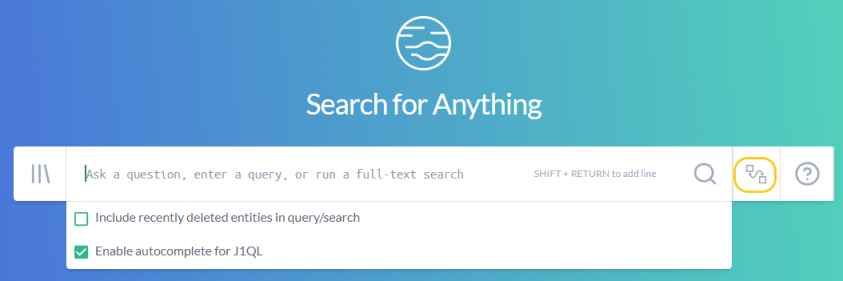
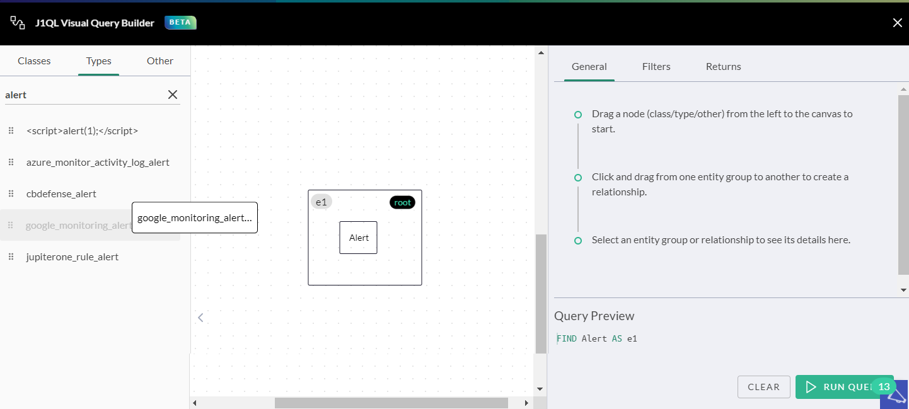
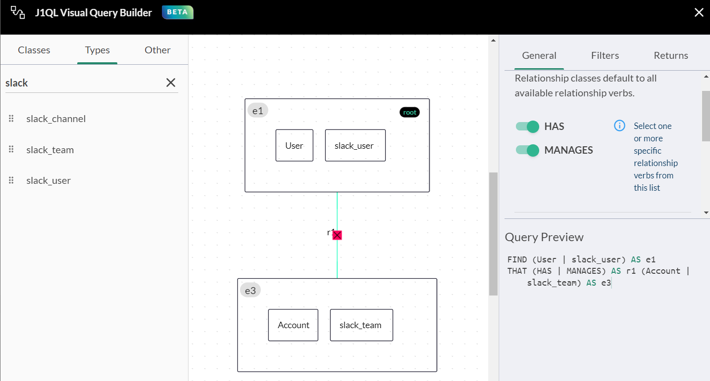
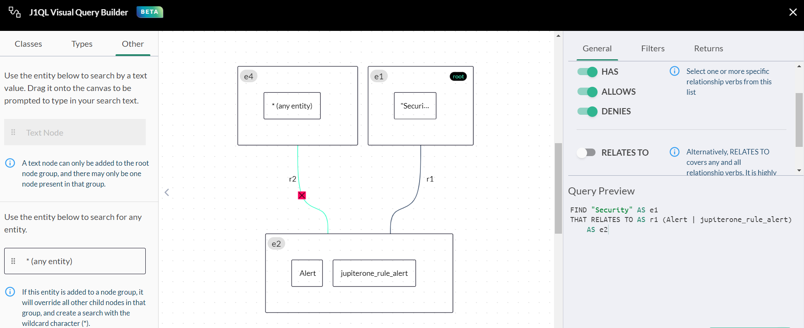
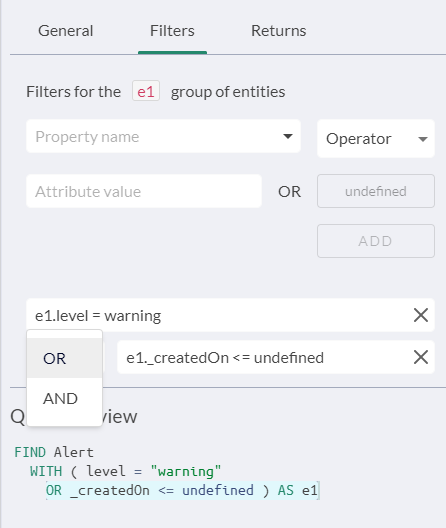

# J1QL Visual Query Builder

JupiterOne Visual Query Builder (VQB) provides a no-code, drag-and-drop, visual interface for building 
JupiterOne queries without needing to learn JupiterOne Query Language (J1QL) syntax.

### Permissions

You must have at least the accessLanding and readGraph roles to use VQB.

### Prerequisites

Your organization must have already used an integration to import your data in to JupiterOne.

### Creating Queries Using VQB

To access VQB, from the Landing page, click .

The VQB workspace consists of a:

- Left pane containing:
  - Default asset classes
  - J1QL-specific, data model asset types
  - Other entities, including text search and * wildcard
    Note: You cannot use a text search asset and a wildcard asset in the same query.
- Center canvas pane
- Right information pane that contains contextual details based on what 
  is on the center canvas,including a query preview window

1. Drag an asset from the left pane to the center canvas to start.

   

   As you place items in the center canvas, a query starts to build in the Query 
   Preview window of the right pane. 

   If you want your query to do a full-text search of your entire graph on a custom 
   text string, click **Other** in the left pane and drag over the Text asset. You are 
   prompted to enter your custom text. You can only do this step at the very 
   beginning of your query build because the custom text string must be the root asset.

2. Drag over all the Class and Type assets between which you want to build relationships.

   - If you want to group assets, drag assets on top of each other to form a group. 
   - Each asset or asset group has a J1 alias identifier in the top-left corner. 
   - Click the asset group to see its details in the right information pane. 
   - The first asset you drag over or asset group you create becomes the root asset 
     or asset group, unless it is a text asset from the Other menu.

3. Click and drag from one asset or asset group box to another asset or asset group box 
   to create a relationship. 

   1. Each relationship has an identifier. 
   2. Click the relationship identifier to see its details in the right information pane.
   3. Relationship classes default to all available verbs. J1QL shows all the verbs that you can 
       apply to that relationship. You can toggle between relationship classes to determine how you 
       want the query to search.
       **Note**: The verb RELATES TO covers any and all relationship verbs. However, It is highly recommended to use specific relationship verbs for faster query performance.
   

4. Continue to drag over assets and create groups and the relationships between them.

#### Using Wildcards

There is a wildcard asset that you can use to represent a relationship with anything. Click ***(any entity)** and drag it to the canvas. Then, in the right pane deselect the relationships that you do not want in your query. If you use the wildcard asset, it overrides all child assets in an asset group of which the wildcard asset is a member.

For example, in the following example, the text asset Security is the root asset. The query does a full text search on all alerts and all JupiterOne alerts assets with the word security in any of the properties. The wildcard asset lists all possible relationships, from which you can toggle on or off the options listed in the right pane according to the information you are seeking.

**Note:** When connecting relationships between assets or asset groups, you must start with the root asset
() and drag it to the related asset (such as e4), and then connect the other assets as required.

### Filtering

You can create filters that are based on all the properties you have for the selected asset on the canvas. You can also apply AND OR conditions to the filters.

 