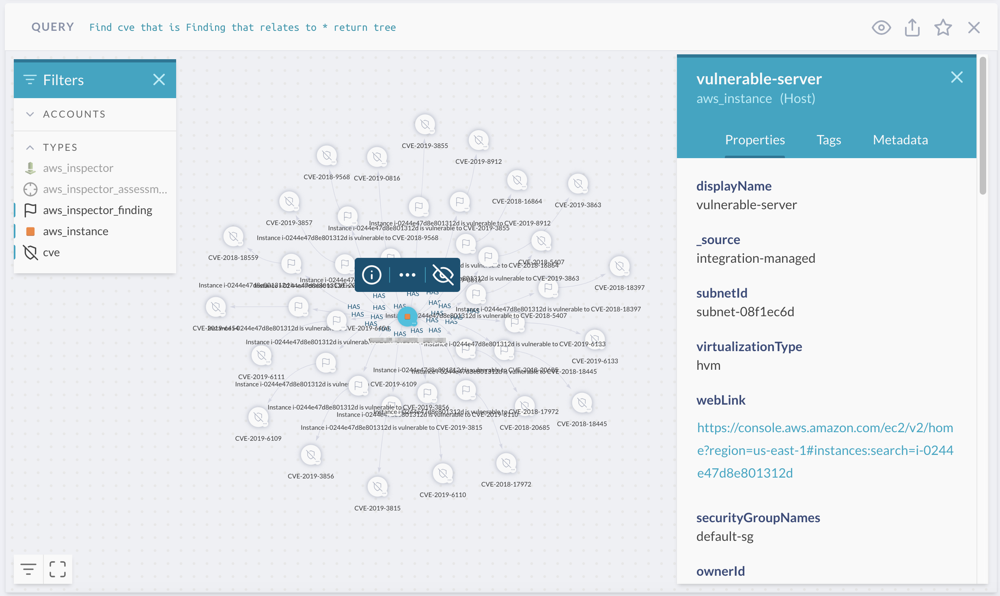

# Navigating the JupiterOne Graphs

JupiterOne is built on a data-driven graph platform. For the story that inspired
us to build it, check out [this blog][1].

JupiterOne query language (J1QL) is designed to traverse this graph and return a
sub-graph -- or data from the nodes (i.e. entities) and edges (i.e.
relationships) of a sub-graph. You can view and interact with the sub-graph from
any J1QL query result.

This guide focuses on interacting with the graph component. For more details on
J1QL, check out the [J1QL tutorial][2] and [technical doc][3].

This screenshot below shows an example result graph from a query in the Landing
app:

The first set of controls on the upper right corner does the following:

| Control | Function
|:-------:| --------
| ![][4]  | **Switch views** between `Table`, `Graph`, `Raw JSON`, and `Pretty JSON`.
| ![][5]  | **Share the query** – shows a modal popup with the weblink to copy and share.
| ![][6]  | **Save the query** – shows a modal popup where you can provide a title, description, and optionally some tags to save it to your own query library.
| ![][7]  | **Remove the result** for this particular query/question from the page view.

Selecting any node (i.e. entity) on the graph will bring up a set of controls
right on top of it that allows you to interact with the node. They serve the
following functions:

| Control | Function
|:-------:| --------
| ![][8]  | **Open side panel** to show the detailed properties, tags and metadata of the selected entity.  Note that you can select an **edge** and see its properties in the side panel as well.
| ![][9]  | **Load neighbors** – bring in additional nodes directly connected to the selected node that are not yet loaded into the graph.
| ![][10] | **Hide selected node** from graph to reduce clutter. You can unhide all hidden nodes from the bottom left control.
| ![][11] | **Expand grouped nodes** of the same type that have the same parent nodes. This option may not be always available depending on the data in the graph.
| ![][12] | **Collapse nodes** of the same type that have the same parent nodes into a group. This option may not be always available depending on the data in the graph.

The last set of controls are at the bottom left corner of the graph, and they do
the following:

| Control | Function
|:-------:| --------
| ![][13] | **Maximize** graph in full screen mode.
| ![][14] | **Restore** graph in query result component.
| ![][15] | **Open filter panel** to let you filter (show/hide) nodes on the graph by **Account** and/or **Type**.
| ![][16] | **Unhide hidden nodes**. This control icon will only show up when there are hidden nodes on the graph.

Here's a screenshot of a graph with the **property panel** and **filter panel**
open:

**Zoom and Move**

| Control         | Function
|:---------------:| --------
| ![][17] ![][18] | **Scroll** using your mouse/touchpad to zoom in/out on the graph
| ![][19]         | **Click and Drag** on a **blank spot** on the graph using your mouse/touchpad to move the graph. **Click and Drag** on a **selected node** to move that particular node.

The stand-alone **Galaxy / Graph Viewer** app uses the same sets of controls.

**That's it!** Now go explore! Check out the [J1QL tutorial][2] if you haven't
yet.

[1]: https://jupiterone.com/blog/three-dimensional-security/
[2]: tutorial-j1ql.md
[3]: ../docs/jupiterone-query-language.md
[4]: https://raw.githubusercontent.com/feathericons/feather/master/icons/eye.svg?sanitize=true
[5]: https://raw.githubusercontent.com/feathericons/feather/master/icons/share.svg?sanitize=true
[6]: https://raw.githubusercontent.com/feathericons/feather/master/icons/star.svg?sanitize=true
[7]: https://raw.githubusercontent.com/feathericons/feather/master/icons/x.svg?sanitize=true
[8]: https://raw.githubusercontent.com/feathericons/feather/master/icons/info.svg?sanitize=true
[9]: https://raw.githubusercontent.com/feathericons/feather/master/icons/more-horizontal.svg?sanitize=true
[10]: https://raw.githubusercontent.com/feathericons/feather/master/icons/eye-off.svg?sanitize=true
[11]: https://raw.githubusercontent.com/feathericons/feather/master/icons/maximize-2.svg?sanitize=true
[12]: https://raw.githubusercontent.com/feathericons/feather/master/icons/minimize-2.svg?sanitize=true
[13]: https://raw.githubusercontent.com/feathericons/feather/master/icons/maximize.svg?sanitize=true
[14]: https://raw.githubusercontent.com/feathericons/feather/master/icons/minimize.svg?sanitize=true
[15]: https://raw.githubusercontent.com/feathericons/feather/master/icons/filter.svg?sanitize=true
[16]: https://raw.githubusercontent.com/feathericons/feather/master/icons/eye.svg?sanitize=true
[17]: https://raw.githubusercontent.com/feathericons/feather/master/icons/zoom-in.svg?sanitize=true
[18]: https://raw.githubusercontent.com/feathericons/feather/master/icons/zoom-out.svg?sanitize=true
[19]: https://raw.githubusercontent.com/feathericons/feather/master/icons/move.svg?sanitize=true