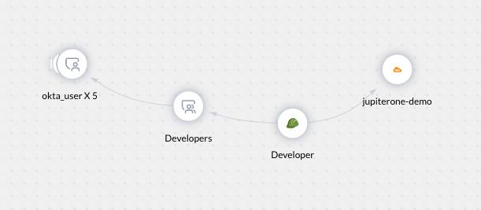
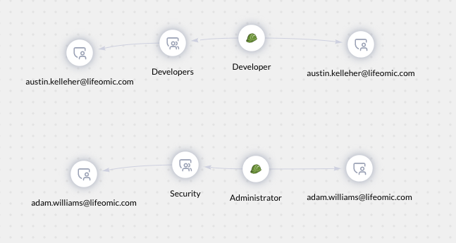
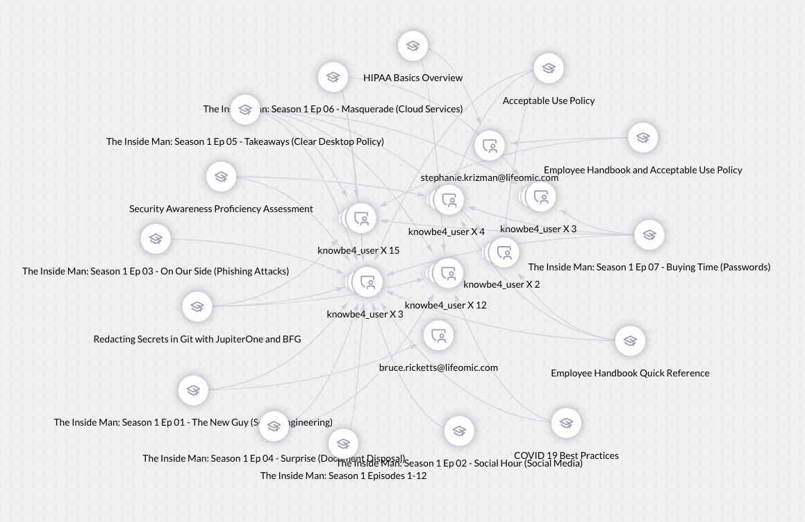
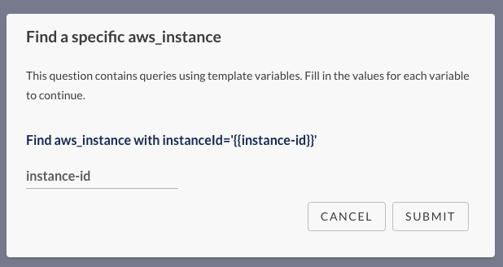
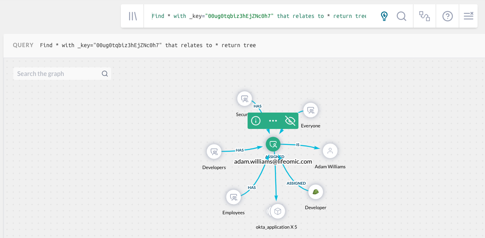
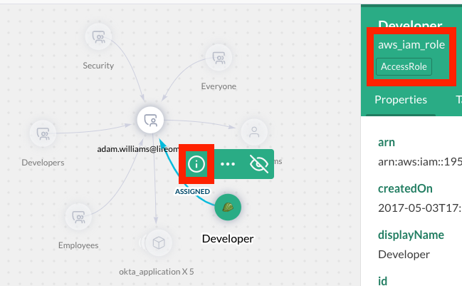

# J1QL Tips and Tricks

This guide contains tips and tricks that assist in creating J1QL queries in your account.
If you haven't already, check out our [J1QL Tutorial](https://support.jupiterone.io/hc/en-us/articles/360022720434-4-9-J1QL-Query-Tutorial)
as well as our [J1QL Language Specs](https://support.jupiterone.io/hc/en-us/articles/360022722014-J1QL-Language-Specs) 
articles for helpful context.

Before creating your own query, we recommend starting with our wide-array of 
[pre-canned questions](https://support.jupiterone.io/hc/en-us/articles/360038496974-Packaged-Questions-Catalog),
tweaking them as needed, then creating your own from scratch.

## When to Use WITH vs WHERE

`WITH` and `WHERE` are both keywords used to filter the results of your query.
The filtering of the results happens either pre-traversal or post-traversal.
`WITH` is used for pre-traversal filtering and `WHERE` is used for
post-traversal filtering.

In a *pre-traversal* filter, the nodes specified in the query are filtered down
before traversing child nodes and finding matching query results.

In a *post-traversal* filter, the entire graph is traversed to find potential
matching query results before filtering occurs on the resulting graph to produce
the final query result.

**TIP** Use `WITH` over `WHERE` when possible as the `WITH` operation is faster
and more efficient.

### WITH

1. `WITH` is used to filter entity **node** properties **pre-traversal**. 

Take the following example.

```j1ql
Find User with name~='john' that HAS UserGroup that ASSIGNED AccessRole that (ALLOWS|TRUSTS) Account
```



The query will find a filtered list of users with a name property that contains
'john'. The query will then find and join any connected UserGroup(s), then
AccessRole(s), and finally Account(s).

### WHERE

1. `WHERE` is used to filter entity **node** properties **post-traversal**.

Let's continue with the previous `WITH` example.

```j1ql
Find User as u1 that HAS UserGroup that ASSIGNED AccessRole that ASSIGNED User as u2 WHERE u1.name=u2.name
```



This query will first find every User that is part of a UserGroup that is
assigned an AccessRole that is assigned a User. Once the results have been been
retrieved, the query will take both Users that were assigned an alias (u1 and
u2), and compare the name property on each. If they match, the filtered result
will be returned.

**TIP** Property comparisons can only be done using `WHERE`.

2. `WHERE` is also used to filter the relationship **edge** properties **post-traversal**.

Let's look at a different example with an edge that has properties.

```j1ql
Find Training as t that ASSIGNED as enrollment User as u WHERE enrollment.completedOn = undefined
```




This query checks the edge, `ASSIGNED`, and filters on its properties. In this
example we find trainings assigned to Users where the `completedOn` date is
undefined (or incomplete).

**REMINDER** Use `WITH` over `WHERE` when possible as the `WITH` operation is faster
and more efficient.

## Variable Placeholders

A variable placeholder(s) is used in the JupiterOne web application to prompt a
user for a specific value(s) to be injected into a pre-saved query. Variable
placeholders can be leveraged in saved J1QL queries using the double curly bracket syntax
`{{variable-placeholder-name}}`.

Take the following pre-saved query as an example.

```j1ql
Find aws_instance with instanceId='{{instance-id}}'
```

Running the above query displays a modal that prompts the user to enter a value.
The query will not execute until you enter a value and press the submit button.



### Create a Question that uses a Placeholder

Variable placeholder syntax cannot be used directly in the search bar.
There are two ways to create a new question and add a variable placeholder.

1. Save a New Question

- Type a query into the search bar and enter a *temporary* value
- Click the star icon to save
- Type in a Title that describes the query (this is the question name)
- Edit the query, replacing the temporary value with `{{your variable placeholder name here}}`
- Click **Save**


2. Duplicate an Existing Question

- Click on the Library icon
- Find an existing question with query elements similar to your new query  
- Click on the Duplicate icon
- Update the Title
- Update the existing query and add `{{your variable placeholder name here}}`
- Click **Save**


**TIPS**
- One or more placeholders can be used in a single saved query.
- Placeholders are only supported in pre-saved queries.

## Leveraging the Graph for Context

Leveraging the graph in JupiterOne to gain context on your cyber security
environment is one useful way construct a J1QL query. You can start from a basic
query or use an existing one to customize a more meaningful query. Check out the 
[J1QL Tutorial](https://support.jupiterone.io/hc/en-us/articles/360022720434-4-9-J1QL-Query-Tutorial)
for an overview of nodes and relationships as they relate to J1QL.

Check out the [Data Model - Overview](https://support.jupiterone.io/hc/en-us/articles/360022903573-Data-Model-Overview)
document for a comprehensive list of JupiterOne entities, their properties, and the relationships between entities. 
The graph is a tool that can be used when these details are unknown.

When traversing the graph from a starting node, you will be able to see and
expand every related node. For a comprehensive list of all entities and
relationships for a specific integration, see the corresponding [Integration Guide](https://support.jupiterone.io/hc/en-us/sections/360004247473-Integrations).

**TIP** When you are in doubt about which verb to use to traverse an edge, use
the catch-all verb `RELATES TO`, which graphs out related entities and the
relationships between them. However, you should not use `RELATES TO` in your
final/saved query because the query will run slow having to check all nodes as
possible children instead of just those connected by a specific edge verb. See
the following example.

```j1ql
Find User that RELATES TO *
```

### In the JupiterOne App

1. To start, navigate to the Landing page of JupiterOne and type in a basic query,
in the example below, replace `DataStore` with the entity class/type you are interested in.


2. Click on the specific result you are interested in. 

3. Click on the vertical ellipses to open additional actions then click **Open in Graph**.


A new browser tab will be opened and will run a query that returns a graph
showing everything related to or mapped to the entity via a relationship.

4. Click on the queried entity and you will see the relationship verbs for each
   mapped entity.



5. The type & class of a node can be determined by by selecting the node,
   clicking the info icon, and looking under the display name.



The `Developer` node from in the example screenshot has a type of `aws_iam_role`
and a class of `AccessRole`. We know the following relationships exist for a
User class.

- A User is ASSIGNED an AccessRole
- A User IS a Person
- A User HAS a UserGroup
- A User is ASSIGNED an Application

These relationships can be used to craft queries.

```j1ql
Find User that ASSIGNED AccessRole
Find User that IS Person
Find User that HAS UserGroup
Find User that ASSIGNED Application
```

**TIP** Relationships can be queried bidirectionally. For example, `Find User
that HAS UserGroup` can also be queried as `Find UserGroup that HAS User` and will
return the same results in the graph. However, the list view will return a list
of `User` for the former or `UserGroup` for the latter depending on which entity you `Find`.

6. Continue to expand the query by clicking on and expanding nodes in the
graph. To do this, select any node and click on the ellipses.


From here we see several additional nodes. We can select a path that we are
interested and continue to expand the graph until we arrive at a query that is
meaningful.

In the following example we traversed from a User to a UserGroup to an AccessRole to an Account. 
Written out more specifically using types we have an okta_user to an okta_user_group to an aws_iam_role to an aws_account.

Our final query could be something similar to the following example, adding in filters, sorting, pagination, etc. as needed. 
See [J1QL Language Specs](https://support.jupiterone.io/hc/en-us/articles/360022722014-J1QL-Language-Specs) to understand the query language features.

```j1ql
Find User that HAS UserGroup that ASSIGNED AccessRole that TRUSTS Account
```


