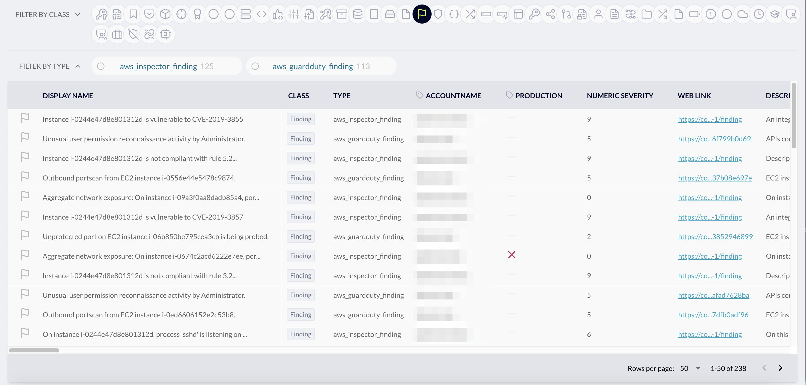

# JupiterOne 2019.20 Release

2019-04-15

## New Features

- Updates to early access **Alerts** app:

  - View alert details and dismiss alerts

  - Create and edit alert rules in the webapp (previously on via the API)

  - First alert rule pack released - rules for AWS configuration auditing:
    <https://github.com/JupiterOne/jupiterone-alert-rules/blob/master/rule-packs/aws-config.json>

    Also see: <https://docs.jupiterone.io/en/latest/guides/j1-queries-for-aws-config.html>

- New **JupiterOne CLI** for querying, entity/relationship/alert operations via
  the command line. A **JupiterOne NodeJS Client** is also available to help
  with your own automation.
  <https://github.com/JupiterOne/jupiterone-client-nodejs>

- Ability to **enable API Key access** for one or more user groups to allow the
  users to generate API used for the external client or CLI.

- **Jira integration** initial release - ingests Jira issues and store them as
  Record entities from specified project(s). Maps the Jira users to employees
  and to the issues they created or reported.

  This is especially useful if you track incidents and risks in Jira and would
  like them to be consolidated and mapped to the rest of your resources.

  _The ability to create a Jira issue from a query or an alert is coming soon._

- **SentinelOne integration** initial release - ingests SentinelOne endpoint
  agents and connects them to the devices and their owners. You can leverage
  the agent status as a contextual data point in security analysis.
  
  For example, the following query gives you a visual graph of the employee that
  has an inactive SentinelOne agent, that person's device, and the user accounts
  that person has access to:

  ```j1ql
  Find sentinelone_agent with isActive!=true as agent
    that protects Device as d
    that relates to Person as p
    that is User as u
    return tree
  ```

  

  
- **AWS Inspector** and **GuardDuty** integration - You can now query for
  Inspector and GuardDuty findings in JupiterOne, and see a graph visualization
  of how the findings relate to CVEs and the resources they impact.

  

  

  - Inspector findings from multiple assessment runs are de-duplicated which
    significantly cuts down the noise.

  - You can also configure alerts based on the configuration and contextual
    relationships of the impacted resources.  For example, an alert with the
    following query:

    ```j1ql
    Find (Host|DataStore) with classification='critical'
      that has Finding with numericSeverity > 7
    ```

- **Backup configuration** is captured for AWS **S3**, **RDS**, and **DynamoDB**
  data stores and databases.  You can simply run the following query to find
  anything that has backup enabled (switch to `false` to find those with no
  backup):

  ```j1ql
  Find DataStore with hasBackup=true
  ```

## Improvements and Bug Fixes

- Improved typography and added app icon to the navigation bar.

- Improved new user onboarding UI/UX.

- Fixed an issue that prevents email address from correctly saving on a `Person`
  entity in the Asset Inventory app.

- Fixed a bug where mapper failed to map a trust relationship in an edge case.

- Several other UI fixes and adjustments.