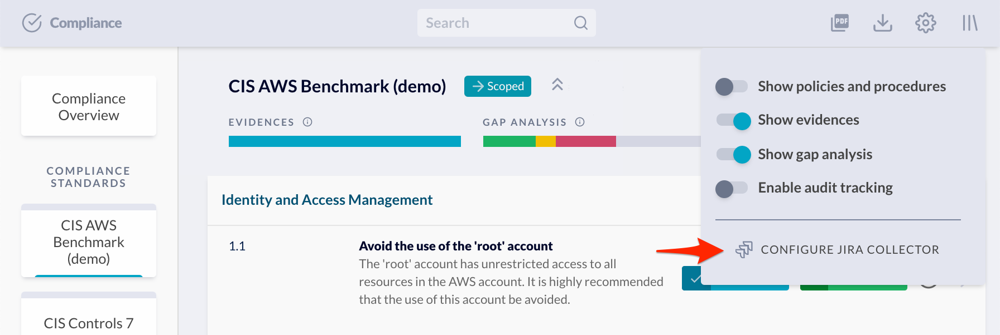

# JupiterOne 2020.55 Release

2020-10-06

## New Features

- Added support for custom Jira Issue Collector in Compliance app such that you can create a Jira
  issue on-demand directly from a requirement view. 

  

  > We plan to improve this on-demand Jira issue creation workflow in the future to support features
  > like auto populating certain fields.

- Added an entity count indicator to each integration instance. Clicking on the entity count chip wil
  run a query to show entity counts from that integration instance by entity `_type`. 

  

- Customers can now start a trial themselves for apps they don't current have access to.

- _We have been secretly working on a compliance review workflow feature. It's now in internal testing. Stay tuned!_

## Integrations

### AWS

* Added support to ingest **Amazon Macie** findings. Try:

  ```j1ql
  Find aws_s3_bucket 
    with classification != 'public' and tag.Production=true
  that has aws_macie_finding 
    with hasSensitiveData = true and detectionsCount > 0 
  return tree
  ```

* Improved trust relationships mapping for IAM SAML federation to Google G Suite accounts.

* Added `netmask` property to `aws_vpc` and `aws_subnet` entities so that users can easily find subnets, 
  or security group rules pointing to subnets with large netmasks in a query -- e.g. `netmask > 16`.

* Improved relationship mapping between Route53 `CNAME` records to EC2 instance entities.

* Fixed missing relationships between `aws_security_group` and `aws_elasticsearch_domain` entities.
  This allows a query to determine if any ElasticSearch domain is publicly facing:

  ```j1ql
  find Internet 
    that allows aws_security_group 
    that protects aws_elasticsearch_domain 
    that has aws_subnet with public=true
  return TREE
  ```

* Changed the Lambda <> VPC relationships so that the `HAS` relationship is built between 
  `aws_lambda_function` and `aws_subnet` entities. This was previously at the `aws_vpc` level 
  which was less accurate. 

  > This is a potentially breaking change if you have existing queries between `aws_vpc` and
  > `aws_lambda_function` entities. 
  >
  > This query:
  > 
  > ```j1ql
  > Find aws_vpc that HAS aws_lambda_function
  > ```
  >
  > Needs to be updated to
  > 
  > ```j1ql
  > Find aws_vpc that CONTAINS aws_subnet that HAS aws_lambda_function
  > ```
  >
  > The `aws_lambda_function` entities will continue to have `vpcId` property that can be used
  > in query filters.

### BambooHR

* Initial release 
* See [docs](../docs/integrations/bamboohr/index.md) for more details

### CloudFlare

- Add `DomainRecord.value` property containing the data of the record

### GoDaddy

* Initial release 
* See [docs](../docs/integrations/godaddy/index.md) for more details

### Google Cloud

* Added ingestion of **networking** resources
  - `google_compute_firewall`
  - `google_compute_network`
  - `google_compute_subnetwork`

* Added ingestion of **KMS** resources
  - `google_kms_key_ring`
  - `google_kms_crypto_key`

* Added new relationships
  - `google_compute_firewall PROTECTS google_compute_network`
  - `google_compute_network CONTAINS google_compute_subnetwork`
  - `google_compute_network HAS google_compute_firewall`
  - `google_compute_subnetwork HAS google_compute_instance`
  - `Internet ALLOWS google_compute_firewall`
  - `Internet DENIES google_compute_firewall`
  - `Host ALLOWS google_compute_firewall`
  - `Host DENIES google_compute_firewall`
  - `Network ALLOWS google_compute_firewall`
  - `Network DENIES google_compute_firewall`
  - `google_kms_key_ring HAS google_kms_crypto_key`

* Fixed duplicate `_key` detected error when the Google Cloud
  `serviceusage.services.list` API returned a duplicate API service
  intermittently.

* Fixed `ComputeInstanceTrustsServiceAccount` relationship which allowed array
  relationships.

* Fixed potential for DUPLICATE_KEY_ERROR in `fetchResourceManagerIamPolicy`.

### Google Workspace (formerly G Suite)

- Fixed an incorrect mapping of users to groups.

## Other Improvements and Bug Fixes

- In the query results table, metadata properties are shown with their actual name the column 
  headers (e.g. `type` -> `_type`, `class` -> `_class`).

- Resolved an issue where the table view Insights chart would clip information on smaller screens.

- Changed the trend chart in Alerts to always starts at 0 for the Y-axis to avoid confusion.

- Resolved an issue where compliance standards would throw a 500 error when being created.
