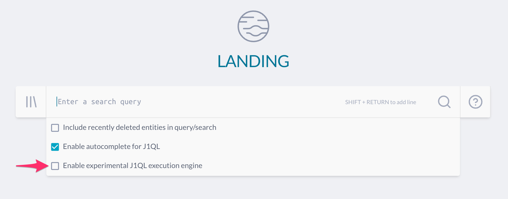

# JupiterOne 2020.60 Release

2020-12-16

## New Features

- New version of the **Policies** app is being rolled out across accounts. This
  does not have much functional change, but behind the scenes it is a major
  overhaul with significant improvements on performance, usability and
  maintainability! This will allows us to add popular feature requests in the
  very near future such as text search across all policy/procedure documents. 

- Beta version of the shiny new **Visual Query Builder**! This allows you to
  build J1QL queries by drag-n-drop and with guided directions. No coding or
  querying knowledge required!

  

- New **J1QL query execution engine**! Currently available as a public beta, the
  new J1QL execution engine is on average **2-3x faster** for queries with
  traversals or aggregates!

  > This has enabled for all accounts as a user-selectable option. To
  > enable, simply check the corresponding box below the search bar in
  > **Landing**.
  >
  > 
  >
  > Please note currently queries via the API still use the legacy execution
  > engine. We are rolling out this new engine across all accounts by EOY. This
  > will be seamlessly deployed and all interfaces including UI and API will
  > switch over. You can experience the power of this improvement sooner via this
  > UI toggle.

- Our integrations list continue to grow and it's getting a little hard to find
  the specific one on the page, so we added the ability to filter the
  integrations list by class/category.

## Integrations

### Integration SDK

- Increased concurrency on integration data uploads.
- Implemented retry logic around integration data uploads.
- Captured `unhandledRejection` and `multipleResolves` silent failures in integrations.
- Significant performance improvements.

### Artifactory

- This integration requires two distinct access tokens. Fixed an issue where the
  pipeline access token was not being validated for this integration, causing
  `UNEXPECTED_ERROR` in the `fetch-pipeline-sources` step.

### Google Cloud

- Added `roles/iam.roleViewer` as a required role in developer documentation.
  This role includes the `resourcemanager.projects.get` permission, which is
  required to access the `/v1/projects/{projectId}` endpoint.
- Improved JupiterOne Google Cloud organization script to walk all folders in an
  organization.
- Improved job log messaging when `/v1/projects/{projectId}` request responds
  with 403:FORBIDDEN. Previously, the job log simply stated "The caller does not
  have permission".

### Okta

- Added early rate limiting of the Okta client. Previously, the client continued
  to make API calls until it received a 429 (exhausting all of the client's rate
  limit), then waited to retry based on response headers. Now, the client will
  accept a `minimumRateLimitRemaining` argument (default=5). When the client
  hits the `minimumRateLimitRemaining` value, it will wait to send the next
  request based on response headers.

### Qualys

- Limit processing to hosts scanned up to the start time of the current
  execution. This helps to avoid an overlap between executions.
- Fixed issue where configuration validation failed to log some details for
  invalid configuration.
- Fixed issue where responses with large bodies would hang the program.
- Fixed error `os.toLowerCase` is not a function when processing host details.
- Added additional Qualys API response error handling.

### Tenable Cloud

- Fixed issue with retry `504` responses

## Community Projects

- Open sourced new `deferred-maintenance` CLI tool to help track "maintenance
  debt" as Finding entities using the JupiterOne graph platform. 

  <https://github.com/JupiterOne/deferred-maintenance>

## Other Improvements and Bug Fixes

- Fixed a UI issue with inconsistent integration job container width.

- Fixed a UI issue with integration setup instructions scrolls the entire page
  instead of the contents in the instructions panel itself.

- Fixed an issue where a user would encounter a 401 error after leaving their
  window open for extended periods of time and returning to the app.

- Fixed an issue with usage limits in the Compliance app.

- Fixed an issue related to bulk jobs timing out in the UI.

- Fixed a UI issue where the Y axis on the account usage would be clipped if the
  value was bigger than 5 digits.
